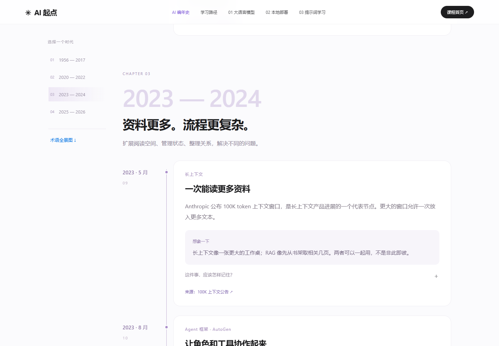
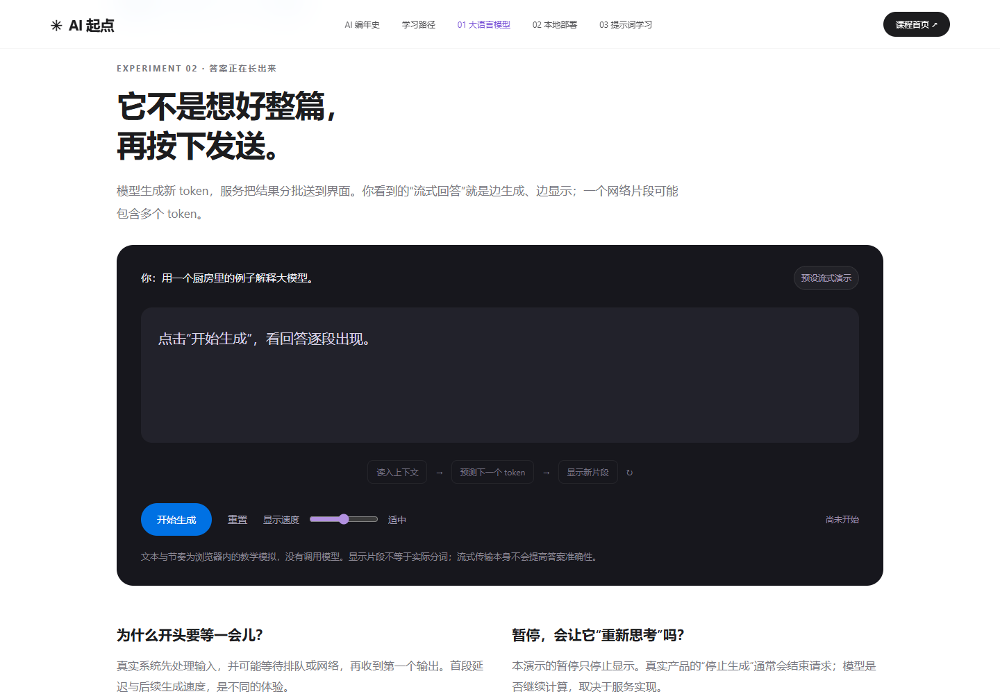
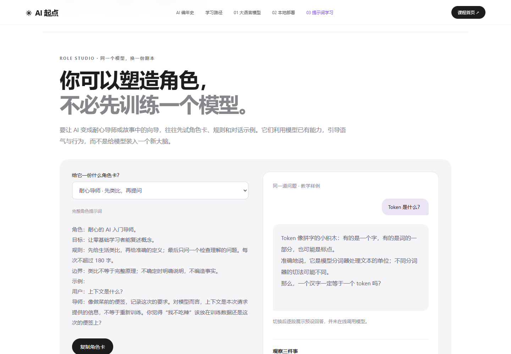

# 给零基础读者做了一个 AI 学习网站：从编年史到本地模型


第一次接触 AI，很容易被一串名字劝退：Transformer、RAG、LangChain、LangGraph、Agent、Harness……每个词都能找到解释，却很难知道它们为什么出现、彼此有什么关系。

我做了一个叫「AI 起点」的网站，想把这些知识放回具体的问题里：AI 如何生成回答？怎么在自己的电脑上运行一个模型？怎样把一句模糊的要求，变成可以检查结果的提示词？

网站以 AI 编年史开场，后面是三门独立课程。设计上采用大字、留白和轻量动效，希望读起来像浏览一个产品页面，也能停下来动手试一试。


## 先看编年史：新名词到底在解决什么问题

时间线从 1956 年延伸到 2026 年，选取了 17 个代表节点。它不是一条“后来的技术必然替代前面的技术”的路线，而是帮助初学者建立地图。

例如，提示词解决的是“怎么把任务说清楚”；RAG 让系统先检索相关资料，再把资料交给模型回答；长上下文让一次输入容纳更多信息，但不保证模型一定能找到每个关键细节。

LangChain 可以帮助连接模型、工具和数据。LangGraph 更侧重带状态的流程编排，适合需要分支、循环和人工检查的应用。知识图谱用实体和关系组织知识，也可以与检索结合。它们有重叠，却不是同一件事。

再往后，Agent 开始围绕目标调用工具、观察结果、继续行动。Harness 则可以理解为围绕模型组织起来的执行环境：提供工具、权限、上下文管理、检查和反馈。模型能力很重要，外围系统同样影响最后能否把任务做完。

渐进式披露也很直观：像打开工具箱，先看目录，真正用到某个工具时再展开说明，减少一次塞进上下文的无关内容。



每个节点都保留了参考链接，也提炼了核心知识和生活化例子。读完感兴趣的部分，再去看论文或官方文档，会更容易找到重点。

## 第一课：把大语言模型想象成一个不断续写的系统

先试一句话：“下午下雨了，出门记得带……”

人会想到雨伞。把前文换成“今晚去健身房，记得带……”，后面的候选就变了。这能帮助理解：生成依赖已经出现的上下文。

真实模型处理的是 token，不一定对应完整的字或词；它根据上下文计算候选 token 的分布，再按生成设置选取下一步，反复进行。这个过程可以形成长回答，也会产生错误。表达流畅不等于事实准确。

页面做了一个可调速度的流式生成演示，支持暂停、继续和重置。看着内容逐段出现，可以把“聊天窗口里不断冒出来的字”与生成过程联系起来。这里的输出和候选概率是预设教学模拟，并没有调用真实模型。



参数、上下文和知识库也容易混淆。我用厨房作类比：模型参数像厨师训练中形成的技能；上下文像本次做菜时摆在台面上的说明与食材；RAG 像先去资料柜找到相关菜谱，再放到台面上。类比并不覆盖全部机制，但足够帮助刚入门的人分清它们。

## 第二课：在本地跑一个小模型

只阅读概念，常常不知道模型究竟怎么用。因此第二课安排了一个很小的实践：通过 Ollama 运行 Qwen3 0.6B。

安装 Ollama 后，在终端运行：

```bash
ollama run qwen3:0.6b
```

模型首次运行需要下载。下载完成后，可以先提问：“用一个生活例子解释什么是上下文，限制在 100 字以内。”再换成更模糊的要求，比较输出差别。

选择小模型是为了降低第一次尝试的门槛。它的复杂推理和知识能力有限，运行速度也取决于设备；不要把一次回答当作对整个 AI 能力的评价。课程还提供了 PowerShell 调用 API 的例子，帮助从聊天走向程序调用。

## 第三课：提示词工程，先从一个具体任务开始

“帮我学习 Python”很难检查是否完成。换成下面的描述，任务就清楚了：

> 我没有编程基础，每天能学习 30 分钟。请给我一个 7 天的 Python 入门安排。每天包含一个知识点、一个可运行例子和一道练习；第 7 天做一个命令行记账程序。不要假设我已经安装开发环境。

这个例子明确了背景、时间、产出和约束。提示词并不是越长越好，关键是把影响结果的信息说清楚，然后拿真实输出检查、修改。

课程还放了提取信息、比较方案、修改文章和角色扮演等配方，介绍从零样本、少样本示例，到结构化输出、工具调用、上下文工程的发展脉络。

角色卡是很有趣的一部分。为“耐心的编程老师”写明教学目标、表达方式和反馈规则，可以让模型更稳定地采用某种行为。SillyTavern 等开源项目提供了可研究的角色设计思路。



在某些语气、格式和工作流程任务里，角色提示词能减少微调需求。但它不会修改模型参数，也不会凭空补上模型缺少的能力，因此不能把它理解为全面替代微调。

提示词注入则展示了另一个问题：当模型读取网页、文件或检索结果时，外部资料里可能夹着“忽略前面的要求”之类的指令。如果系统把资料当成了可信命令，就可能偏离原任务。

页面用对照模拟帮助理解风险。实际应用仍需要区分可信指令与外部数据，限制工具权限，校验输出并测试攻击场景；仅靠一句“不要被注入”或几个分隔符并不够。

## 源码与继续学习

项目使用原生 HTML、CSS 和 JavaScript，没有构建步骤。页面有独立地址，也做了同源预加载和页面内切换，减少课程之间跳转的等待。

README 收录了截图、运行方式和演示边界。仓库地址：[AI 起点](https://github.com/yushajiang/ai-learning)。仓库当前按私有设置，公开后读者才能直接访问。

推荐继续阅读的原始资料：

- [Hugging Face：什么是大语言模型](https://huggingface.co/learn/agents-course/en/unit1/what-are-llms)
- [Ollama 快速入门](https://docs.ollama.com/quickstart)
- [SillyTavern 角色设计](https://docs.sillytavern.app/usage/core-concepts/characterdesign/)
- [DSPy 开源项目](https://github.com/stanfordnlp/dspy)
- [LangGraph 介绍](https://www.langchain.com/blog/langgraph)
- [Anthropic：上下文工程](https://www.anthropic.com/engineering/effective-context-engineering-for-ai-agents)

站点中的互动实验均为教学模拟。真实模型的输出会随模型版本、设置和输入变化；嵌入视频的播放也取决于网络可达性。
